<!--
**PCMedicalist/pcmedicalist** is a ✨ _special_ ✨ repository because its `README.md` (this file) appears on your GitHub profile.

Here are some ideas to get you started:

- 🔭 I’m currently working on ...
- 🌱 I’m currently learning ...
- 👯 I’m looking to collaborate on ...
- 🤔 I’m looking for help with ...
- 💬 Ask me about ...
- 📫 How to reach me: ...
- 😄 Pronouns: ...
- ⚡ Fun fact: ...
-->
<p align="center">
  
</p>

<p align="center">
  
</p>

---

## 🧠 SYSTEM CORE

```diff
+ NODE ID: PCMedicalist
+ TYPE: Hybrid Engineering System
+ MODE: Autonomous / Assisted
+ STATUS: ACTIVE
```

> You are now connected to a live system.

PCMedicalist is a **high-performance engineering node** focused on building, optimizing, and deploying:

* 🖥️ Custom PC Systems
* ⚙️ Performance Infrastructure
* 🤖 Automation & Agent Systems
* 🌐 Digital Platforms

---

## 📡 LIVE TELEMETRY

```yaml
core_systems: online
active_builds: 3
latency: optimal
deployments: scaling
ai_modules: initializing
```

<p align="center">
  
</p>

<p align="center">
  
</p>

---

## ⚙️ SYSTEM MODULES

<details>
<summary>🖥️ HARDWARE ENGINEERING</summary>

* Custom Gaming Rigs
* Workstation Optimization
* Thermal + Performance Tuning
* Visual System Design

</details>

<details>
<summary>📡 STREAMING INFRASTRUCTURE</summary>

* OBS Optimization
* Twitch Integration
* Multi-platform streaming
* Performance routing

</details>

<details>
<summary>🤖 AUTONOMOUS SYSTEMS</summary>

* AI Agent Development
* Task Automation
* Monitoring Systems
* Event-driven architecture

</details>

<details>
<summary>🌐 DIGITAL DEPLOYMENTS</summary>

* Website builds
* Full-stack systems
* Cloud deployment
* End-to-end support

</details>

---

## 🧰 TECH STACK

<p align="center">


</p>

---

## 🧪 EXPERIMENTAL LAB

<details>
<summary>⚠️ ACCESS RESTRICTED</summary>

* Autonomous agents in development
* AI workflow pipelines
* Real-time monitoring systems
* Blockchain integrations (next phase)

</details>

---

## 🐍 ACTIVITY STREAM

<p align="center">
  
</p>

---

## 🌐 NETWORK ACCESS

```ini
[PRIMARY NODE]
https://pcmedicalist.com

[STREAM]
Twitch.tv/PCMedicalist

[COMMUNITY]
Discord (Private Network)
```

---

## ⚡ FINAL STATUS

```diff
+ SYSTEM ONLINE
+ READY FOR DEPLOYMENT
+ AWAITING NEXT COMMAND
```
